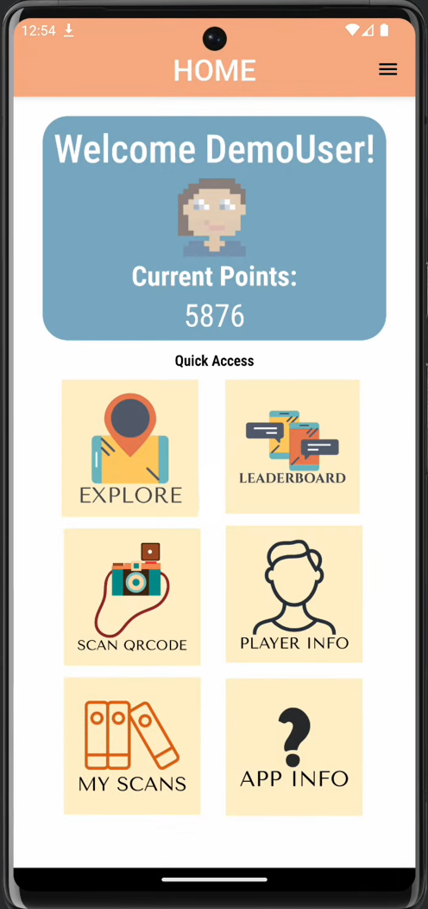
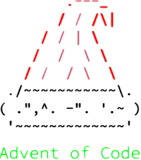
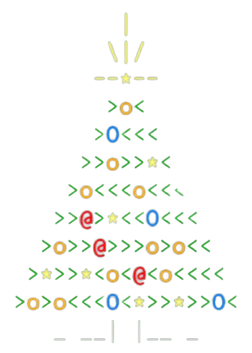

<h2>Hi There! I'm Carson Barnstable!</h2>
<h4>Current Student at the University of Alberta (Edmonton, AB) Pursuing a Specialization in Computing Science with a Minor in Business</h4>
<ph4><b>You can Access my (Hopefully) most Up-to-Date Resume <a href="https://github.com/CarsonBarnstable/CarsonBarnstable/blob/main/resume/CarsonBarnstable_Resume.pdf">HERE</a></b></h4>
<h3>I have Experience with the Following Languages and Tools:</h3>

 </a>       <a href="https://git-scm.com/" target="_blank" rel="noreferrer">   <a href="https://code.visualstudio.com/" target="_blank" rel="noreferrer">               

  
<h2>You should See my Projects!!</h3>
  
| PyGame_Tetris [`<LINK>`](https://github.com/CarsonBarnstable/PyGame_Tetris) | QR Hunter [`<LINK>`](https://github.com/CarsonBarnstable/CMPUT301W23T31Project/) | Advent of Code '23 [`<LINK>`](https://github.com/CarsonBarnstable/Advent_of_Code_2023/) |
| --- | --- | --- |
| Created a Tetris game that is able to play itself, and able to improve its playing strategy through repeated playing | QR Code hunting/scanning Game, with interactive maps, leaderboards, and ranked leagues | Done in Python over Christmas 2023 : Finished Top 2% Overall for Completion (Full Stars in First 23 of 25 Days) |
|  |  |  &nbsp;  |
| - Started with Tetris Clone - Added Ability for Game to Play by Itself - Added Genetic Algorithm to "Train" Strategy through Playing | - Created for CMPUT301 Group Project - Built Fully-Functioning Android App - Uses Firebase for Game Detail Database, and Maps SDK for Location/Maps Details | details |
